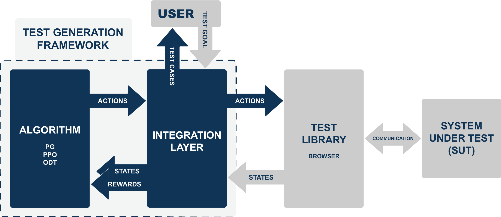

# ATAG - Automated Test Automation Generation

A black-box test generation framework for test libraries. ATAG employs machine learning algorithms to construct test cases based on testing goals specified by the user. This version, created for a master's thesis, is currently in the prototype phase. Instructions will be updated at a later time.

Implementations ready for test generation:
- Vanilla Policy Gradient (PG)
- Proximal Policy Optimization (PPO)
- Online Decision Transformer (ODT)

More info: [www.rikulehtonen.fi/projects/atag](https://www.rikulehtonen.fi/projects/atag)



## Installation

Detailed instructions are updated later.

1. Install pytorch
[https://pytorch.org/get-started/locally/](https://pytorch.org/get-started/locally/)

2. Install requirements
```bash
pip install -r requirements.txt
```

## Usage

Benchmarking tools are moved to [https://github.com/rikulehtonen/testgen-benchmarks](https://github.com/rikulehtonen/testgen-benchmarks)

## Contributing

This is a repository for a master thesis project. Pull requests are not possible for the time being.

## License

[Apache License 2.0](https://choosealicense.com/licenses/apache-2.0/)
